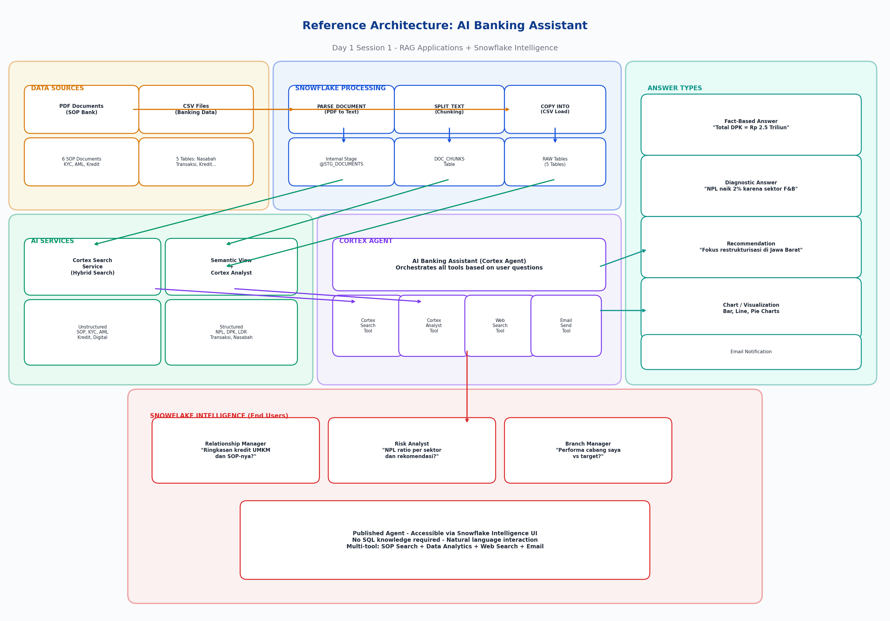

# Day 1 - Session 1: RAG Applications + Snowflake Intelligence

## Workshop: Snowflake x Bank
### "Membangun AI Banking Assistant dengan Snowflake Cortex AI"

---

## Arsitektur Workshop



Pada session ini, kita akan membangun **AI Banking Assistant** yang mampu:
1. Menjawab pertanyaan berdasarkan **dokumen SOP internal bank** (unstructured data)
2. Menjawab pertanyaan berdasarkan **data operasional perbankan** (structured data)
3. Melakukan **web search** untuk informasi terkini
4. Memberikan jawaban berupa **chart, fact-based, diagnostic, dan recommendation**
5. Mengirim **email** notifikasi

---

## Daftar Isi

- [Part 1: Environment Setup & Data Loading](#part-1-environment-setup--data-loading)
- [Part 2: Unstructured Data Processing & Cortex Search](#part-2-unstructured-data-processing--cortex-search)
- [Part 3: Structured Data & Semantic View (Cortex Analyst)](#part-3-structured-data--semantic-view-cortex-analyst)
- [Part 4: Cortex Agent - AI Banking Assistant](#part-4-cortex-agent---ai-banking-assistant)
- [Part 5: Snowflake Intelligence - Publish Agent](#part-5-snowflake-intelligence---publish-agent)

---

## Pre-requisites

- Snowflake Trial Account (Enterprise Edition atau lebih tinggi)
- Region: **AWS US West 2 (Oregon)** atau **AWS AP Southeast 1 (Singapore)** - pastikan Cortex AI tersedia
- Role: ACCOUNTADMIN (untuk setup awal)

---

## Part 1: Environment Setup & Data Loading

### Step 1.1: Buat Database dan Schema

```sql
-- ============================================
-- STEP 1.1: Setup Database & Schema
-- ============================================
USE ROLE ACCOUNTADMIN;

-- Buat warehouse untuk workshop
CREATE OR REPLACE WAREHOUSE BANK_WH
    WAREHOUSE_SIZE = 'MEDIUM'
    AUTO_SUSPEND = 120
    AUTO_RESUME = TRUE
    COMMENT = 'Warehouse untuk Workshop Bank';

USE WAREHOUSE BANK_WH;

-- Buat database workshop
CREATE OR REPLACE DATABASE BANK_DB
    COMMENT = 'Database Workshop AI Banking - Bank';

-- Buat schema untuk data
CREATE OR REPLACE SCHEMA BANK_DB.RAW_DATA
    COMMENT = 'Schema untuk raw data (CSV dan PDF)';

CREATE OR REPLACE SCHEMA BANK_DB.ANALYTICS
    COMMENT = 'Schema untuk analytics dan AI models';

USE SCHEMA BANK_DB.RAW_DATA;
```

### Step 1.2: Buat Stage untuk Upload File

```sql
-- ============================================
-- STEP 1.2: Buat Internal Stage
-- ============================================

-- Stage untuk file PDF (unstructured data)
CREATE OR REPLACE STAGE STG_DOCUMENTS
    DIRECTORY = (ENABLE = TRUE)
    COMMENT = 'Stage untuk dokumen SOP bank (PDF)';

-- Stage untuk file CSV (structured data)
CREATE OR REPLACE STAGE STG_CSV_DATA
    COMMENT = 'Stage untuk data CSV (nasabah, transaksi, kredit, dll)';
```

### Step 1.3: Upload File ke Stage

> **Cara Upload via Snowsight:**
> 1. Navigasi ke **Data** > **Databases** > **BANK_DB** > **RAW_DATA** > **Stages**
> 2. Klik pada stage **STG_DOCUMENTS**
> 3. Klik tombol **+ Files** di kanan atas
> 4. Upload semua file PDF dari folder `data/unstructured/`
> 5. Ulangi untuk stage **STG_CSV_DATA** dengan file CSV dari folder `data/structured/`

Atau menggunakan SnowSQL / Snowflake CLI:

```bash
# Upload PDF files
snow stage copy data/unstructured/*.pdf @BANK_DB.RAW_DATA.STG_DOCUMENTS --database BANK_DB --schema RAW_DATA

# Upload CSV files
snow stage copy data/structured/*.csv @BANK_DB.RAW_DATA.STG_CSV_DATA --database BANK_DB --schema RAW_DATA
```

Verifikasi file sudah ter-upload:

```sql
-- Verifikasi PDF files
LIST @STG_DOCUMENTS;

-- Verifikasi CSV files
LIST @STG_CSV_DATA;
```

### Step 1.4: Buat Table dan Load Data dari CSV

```sql
-- ============================================
-- STEP 1.4: Create Tables & Load CSV Data
-- ============================================

-- Table: DIM_CABANG
CREATE OR REPLACE TABLE DIM_CABANG (
    cabang_id VARCHAR(10),
    nama_cabang VARCHAR(200),
    kota VARCHAR(100),
    provinsi VARCHAR(100),
    region VARCHAR(100),
    tipe_cabang VARCHAR(10),
    jumlah_karyawan INT,
    tanggal_berdiri DATE,
    status_aktif VARCHAR(20)
);

COPY INTO DIM_CABANG
FROM @STG_CSV_DATA/dim_cabang.csv
FILE_FORMAT = (TYPE = 'CSV' SKIP_HEADER = 1 FIELD_OPTIONALLY_ENCLOSED_BY = '"');

-- Table: DIM_NASABAH
CREATE OR REPLACE TABLE DIM_NASABAH (
    nasabah_id VARCHAR(15),
    nama_lengkap VARCHAR(200),
    nik VARCHAR(20),
    no_hp VARCHAR(20),
    email VARCHAR(200),
    tanggal_lahir DATE,
    jenis_kelamin VARCHAR(20),
    segmen_nasabah VARCHAR(30),
    cabang_id VARCHAR(10),
    tanggal_buka_rekening DATE,
    status_aktif VARCHAR(20),
    pekerjaan VARCHAR(50),
    penghasilan_bulanan NUMBER(15,0)
);

COPY INTO DIM_NASABAH
FROM @STG_CSV_DATA/dim_nasabah.csv
FILE_FORMAT = (TYPE = 'CSV' SKIP_HEADER = 1 FIELD_OPTIONALLY_ENCLOSED_BY = '"');

-- Table: FACT_TRANSAKSI
CREATE OR REPLACE TABLE FACT_TRANSAKSI (
    transaksi_id VARCHAR(15),
    nasabah_id VARCHAR(15),
    tanggal_transaksi TIMESTAMP,
    jenis_transaksi VARCHAR(50),
    jumlah NUMBER(15,0),
    channel VARCHAR(30),
    status VARCHAR(20),
    keterangan VARCHAR(200)
);

COPY INTO FACT_TRANSAKSI
FROM @STG_CSV_DATA/fact_transaksi.csv
FILE_FORMAT = (TYPE = 'CSV' SKIP_HEADER = 1 FIELD_OPTIONALLY_ENCLOSED_BY = '"');

-- Table: FACT_KREDIT
CREATE OR REPLACE TABLE FACT_KREDIT (
    kredit_id VARCHAR(15),
    nasabah_id VARCHAR(15),
    jenis_kredit VARCHAR(50),
    jumlah_pinjaman NUMBER(15,0),
    outstanding NUMBER(15,0),
    tenor_bulan INT,
    suku_bunga_persen FLOAT,
    tanggal_pencairan DATE,
    tanggal_jatuh_tempo DATE,
    status_kolektibilitas VARCHAR(50),
    agunan VARCHAR(100),
    sektor_ekonomi VARCHAR(50)
);

COPY INTO FACT_KREDIT
FROM @STG_CSV_DATA/fact_kredit.csv
FILE_FORMAT = (TYPE = 'CSV' SKIP_HEADER = 1 FIELD_OPTIONALLY_ENCLOSED_BY = '"');

-- Table: FACT_SIMPANAN
CREATE OR REPLACE TABLE FACT_SIMPANAN (
    simpanan_id VARCHAR(15),
    nasabah_id VARCHAR(15),
    jenis_simpanan VARCHAR(20),
    saldo NUMBER(15,0),
    suku_bunga_persen FLOAT,
    tanggal_buka DATE,
    mata_uang VARCHAR(5),
    status VARCHAR(20)
);

COPY INTO FACT_SIMPANAN
FROM @STG_CSV_DATA/fact_simpanan.csv
FILE_FORMAT = (TYPE = 'CSV' SKIP_HEADER = 1 FIELD_OPTIONALLY_ENCLOSED_BY = '"');
```

### Step 1.5: Verifikasi Data

```sql
-- ============================================
-- STEP 1.5: Verifikasi Data
-- ============================================
SELECT 'DIM_CABANG' AS tabel, COUNT(*) AS jumlah_row FROM DIM_CABANG
UNION ALL
SELECT 'DIM_NASABAH', COUNT(*) FROM DIM_NASABAH
UNION ALL
SELECT 'FACT_TRANSAKSI', COUNT(*) FROM FACT_TRANSAKSI
UNION ALL
SELECT 'FACT_KREDIT', COUNT(*) FROM FACT_KREDIT
UNION ALL
SELECT 'FACT_SIMPANAN', COUNT(*) FROM FACT_SIMPANAN;

-- Preview data
SELECT * FROM DIM_NASABAH LIMIT 5;
SELECT * FROM FACT_TRANSAKSI LIMIT 5;
```

---

## Part 2: Unstructured Data Processing & Cortex Search

### Step 2.1: Extract Text dari PDF menggunakan PARSE_DOCUMENT

```sql
-- ============================================
-- STEP 2.1: Extract text dari PDF
-- ============================================
USE SCHEMA BANK_DB.ANALYTICS;

-- Buat table untuk menyimpan hasil extract PDF
CREATE OR REPLACE TABLE DOC_SOP_BANK AS
SELECT
    RELATIVE_PATH AS file_name,
    FILE_URL AS file_url,
    SNOWFLAKE.CORTEX.PARSE_DOCUMENT(
        @BANK_DB.RAW_DATA.STG_DOCUMENTS,
        RELATIVE_PATH,
        {'mode': 'LAYOUT'}
    ):content::VARCHAR AS extracted_text
FROM DIRECTORY(@BANK_DB.RAW_DATA.STG_DOCUMENTS)
WHERE RELATIVE_PATH LIKE '%.pdf';

-- Verifikasi hasil extract
SELECT file_name, LEFT(extracted_text, 500) AS preview
FROM DOC_SOP_BANK;
```

### Step 2.2: Chunking Text menggunakan SPLIT_TEXT_RECURSIVE_CHARACTER

```sql
-- ============================================
-- STEP 2.2: Chunking dokumen
-- ============================================

-- Buat table chunks dari dokumen
CREATE OR REPLACE TABLE DOC_CHUNKS AS
SELECT
    d.file_name,
    d.file_url,
    c.value::VARCHAR AS chunk_text,
    c.index AS chunk_index
FROM DOC_SOP_BANK d,
LATERAL FLATTEN(
    SNOWFLAKE.CORTEX.SPLIT_TEXT_RECURSIVE_CHARACTER(
        d.extracted_text,
        'markdown',
        1500,   -- chunk size (characters)
        300     -- overlap (characters)
    )
) c;

-- Lihat jumlah chunks per dokumen
SELECT file_name, COUNT(*) AS jumlah_chunks
FROM DOC_CHUNKS
GROUP BY file_name
ORDER BY jumlah_chunks DESC;

-- Preview chunks
SELECT file_name, chunk_index, LEFT(chunk_text, 200) AS preview
FROM DOC_CHUNKS
ORDER BY file_name, chunk_index
LIMIT 10;
```

### Step 2.3: Buat Cortex Search Service

```sql
-- ============================================
-- STEP 2.3: Buat Cortex Search Service
-- ============================================

CREATE OR REPLACE CORTEX SEARCH SERVICE BANK_SOP_SEARCH
    ON chunk_text
    ATTRIBUTES file_name
    WAREHOUSE = BANK_WH
    TARGET_LAG = '1 hour'
    COMMENT = 'Search service untuk dokumen SOP Bank'
AS (
    SELECT
        chunk_text,
        file_name,
        file_url,
        chunk_index
    FROM DOC_CHUNKS
);

-- Verifikasi search service sudah aktif
SHOW CORTEX SEARCH SERVICES;
```

### Step 2.4: Test Cortex Search

```sql
-- ============================================
-- STEP 2.4: Test Cortex Search
-- ============================================

-- Test query 1: Cari informasi tentang pembukaan rekening
SELECT PARSE_JSON(
    SNOWFLAKE.CORTEX.SEARCH_PREVIEW(
        'BANK_DB.ANALYTICS.BANK_SOP_SEARCH',
        '{
            "query": "apa syarat pembukaan rekening baru untuk WNA?",
            "columns": ["chunk_text", "file_name"],
            "limit": 3
        }'
    )
) AS results;

-- Test query 2: Cari informasi tentang KYC
SELECT PARSE_JSON(
    SNOWFLAKE.CORTEX.SEARCH_PREVIEW(
        'BANK_DB.ANALYTICS.BANK_SOP_SEARCH',
        '{
            "query": "bagaimana prosedur KYC untuk nasabah berisiko tinggi?",
            "columns": ["chunk_text", "file_name"],
            "limit": 3
        }'
    )
) AS results;

-- Test query 3: Cari informasi AML
SELECT PARSE_JSON(
    SNOWFLAKE.CORTEX.SEARCH_PREVIEW(
        'BANK_DB.ANALYTICS.BANK_SOP_SEARCH',
        '{
            "query": "apa saja red flags transaksi mencurigakan money laundering?",
            "columns": ["chunk_text", "file_name"],
            "limit": 3
        }'
    )
) AS results;
```

### Step 2.5: Konfigurasi Cortex Search di Agent (Snowflake Intelligence)

Saat **Add Cortex Search Service** di Agent UI, isi:

| Field | Value | Keterangan |
|-------|-------|------------|
| **Search service** | `BANK_DB.ANALYTICS.BANK_SOP_SEARCH` | Service yang baru dibuat |
| **ID column** | `FILE_URL` | Unik per chunk, digunakan untuk deduplikasi & link balik ke file |
| **Title column** | `FILE_NAME` | Akan tampil sebagai judul citation di jawaban agent |

> **Catatan:** `FILE_URL` dan `FILE_NAME` otomatis tersedia karena kedua kolom ini di-`SELECT` saat membuat search service di Step 2.3.

---

## Part 3: Structured Data & Semantic View (Cortex Analyst)

### Step 3.1: Buat Semantic View

```sql
-- ============================================
-- STEP 3.1: Buat Semantic View untuk Cortex Analyst
-- ============================================
USE SCHEMA BANK_DB.ANALYTICS;

CREATE OR REPLACE SEMANTIC VIEW BANK_ANALYTICS_SV
  COMMENT = 'Semantic View untuk analisis data operasional Bank - mencakup data nasabah, transaksi, kredit, dan simpanan'
AS
  -- Table: Nasabah (Customer Master)
  TABLES (
    BANK_DB.RAW_DATA.DIM_NASABAH
      AS NASABAH
      COMMENT = 'Data master nasabah bank termasuk informasi demografis dan segmentasi'
      PRIMARY KEY (nasabah_id)
      WITH COLUMNS (
        nasabah_id
          COMMENT = 'ID unik nasabah'
          SYNONYMS = ('customer id', 'id nasabah', 'nomor nasabah'),
        nama_lengkap
          COMMENT = 'Nama lengkap nasabah'
          SYNONYMS = ('nama', 'customer name', 'nama nasabah'),
        nik
          COMMENT = 'Nomor Induk Kependudukan (NIK) nasabah'
          SYNONYMS = ('KTP', 'nomor KTP', 'identitas'),
        segmen_nasabah
          COMMENT = 'Segmen nasabah: Retail, Priority, SME, Corporate, Private Banking'
          SYNONYMS = ('segmen', 'segment', 'kategori nasabah', 'tipe nasabah'),
        cabang_id
          COMMENT = 'ID cabang tempat nasabah terdaftar'
          SYNONYMS = ('branch id', 'kode cabang'),
        tanggal_buka_rekening
          COMMENT = 'Tanggal pertama kali nasabah membuka rekening'
          SYNONYMS = ('tanggal join', 'registration date', 'tanggal daftar'),
        status_aktif
          COMMENT = 'Status nasabah: Aktif atau Tidak Aktif'
          SYNONYMS = ('status', 'active status'),
        pekerjaan
          COMMENT = 'Pekerjaan nasabah'
          SYNONYMS = ('occupation', 'profesi', 'job'),
        penghasilan_bulanan
          COMMENT = 'Penghasilan bulanan nasabah dalam Rupiah'
          SYNONYMS = ('gaji', 'income', 'pendapatan', 'salary'),
        jenis_kelamin
          COMMENT = 'Jenis kelamin: Laki-laki atau Perempuan'
          SYNONYMS = ('gender', 'kelamin')
      ),

    BANK_DB.RAW_DATA.DIM_CABANG
      AS CABANG
      COMMENT = 'Data master cabang bank termasuk lokasi dan tipe cabang'
      PRIMARY KEY (cabang_id)
      WITH COLUMNS (
        cabang_id
          COMMENT = 'ID unik cabang'
          SYNONYMS = ('branch id', 'kode cabang'),
        nama_cabang
          COMMENT = 'Nama lengkap cabang'
          SYNONYMS = ('branch name', 'nama branch'),
        kota
          COMMENT = 'Kota lokasi cabang'
          SYNONYMS = ('city', 'kota cabang'),
        provinsi
          COMMENT = 'Provinsi lokasi cabang'
          SYNONYMS = ('province', 'propinsi'),
        region
          COMMENT = 'Region operasional cabang'
          SYNONYMS = ('wilayah', 'area', 'regional'),
        tipe_cabang
          COMMENT = 'Tipe cabang: KC (Kantor Cabang), KCP (Kantor Cabang Pembantu), KK (Kantor Kas)'
          SYNONYMS = ('branch type', 'jenis cabang')
      ),

    BANK_DB.RAW_DATA.FACT_TRANSAKSI
      AS TRANSAKSI
      COMMENT = 'Data transaksi harian nasabah termasuk transfer, penarikan, setoran, dan pembayaran'
      PRIMARY KEY (transaksi_id)
      WITH COLUMNS (
        transaksi_id
          COMMENT = 'ID unik transaksi'
          SYNONYMS = ('transaction id', 'nomor transaksi'),
        nasabah_id
          COMMENT = 'ID nasabah yang melakukan transaksi'
          SYNONYMS = ('customer id'),
        tanggal_transaksi
          COMMENT = 'Tanggal dan waktu transaksi dilakukan'
          SYNONYMS = ('transaction date', 'waktu transaksi', 'tanggal'),
        jenis_transaksi
          COMMENT = 'Jenis transaksi: Transfer, Tarik Tunai, Setor Tunai, Pembayaran Tagihan, Top Up e-Wallet, Pembelian, QRIS Payment'
          SYNONYMS = ('transaction type', 'tipe transaksi', 'jenis'),
        jumlah
          COMMENT = 'Nominal transaksi dalam Rupiah'
          SYNONYMS = ('amount', 'nominal', 'nilai transaksi'),
        channel
          COMMENT = 'Channel transaksi: Mobile Banking, ATM, Teller, Internet Banking, EDC, QRIS'
          SYNONYMS = ('kanal', 'media transaksi'),
        status
          COMMENT = 'Status transaksi: Berhasil atau Gagal'
          SYNONYMS = ('transaction status', 'status transaksi')
      ),

    BANK_DB.RAW_DATA.FACT_KREDIT
      AS KREDIT
      COMMENT = 'Data portofolio kredit/pinjaman termasuk KPR, KKB, KUR, dan kredit modal kerja'
      PRIMARY KEY (kredit_id)
      WITH COLUMNS (
        kredit_id
          COMMENT = 'ID unik kredit'
          SYNONYMS = ('loan id', 'nomor kredit'),
        nasabah_id
          COMMENT = 'ID nasabah peminjam'
          SYNONYMS = ('customer id', 'borrower'),
        jenis_kredit
          COMMENT = 'Jenis produk kredit: KPR, KKB, Kredit Modal Kerja, Kredit Investasi, KUR Mikro, KUR Kecil, Kredit Multiguna, Kartu Kredit'
          SYNONYMS = ('loan type', 'tipe kredit', 'produk kredit'),
        jumlah_pinjaman
          COMMENT = 'Total plafon kredit dalam Rupiah'
          SYNONYMS = ('loan amount', 'plafon', 'principal'),
        outstanding
          COMMENT = 'Sisa pokok pinjaman yang belum dibayar dalam Rupiah'
          SYNONYMS = ('sisa pinjaman', 'remaining balance', 'baki debet'),
        tenor_bulan
          COMMENT = 'Jangka waktu kredit dalam bulan'
          SYNONYMS = ('tenor', 'loan term', 'jangka waktu'),
        suku_bunga_persen
          COMMENT = 'Suku bunga kredit per tahun dalam persen'
          SYNONYMS = ('interest rate', 'bunga', 'rate'),
        tanggal_pencairan
          COMMENT = 'Tanggal kredit dicairkan'
          SYNONYMS = ('disbursement date', 'tanggal cair'),
        status_kolektibilitas
          COMMENT = 'Status kualitas kredit sesuai OJK: 1-Lancar, 2-Dalam Perhatian Khusus, 3-Kurang Lancar, 4-Diragukan, 5-Macet. Kredit bermasalah (NPL) adalah kolektibilitas 3, 4, dan 5.'
          SYNONYMS = ('collectibility', 'kualitas kredit', 'status kredit', 'NPL status', 'kolektibilitas'),
        agunan
          COMMENT = 'Jenis agunan/jaminan kredit'
          SYNONYMS = ('collateral', 'jaminan'),
        sektor_ekonomi
          COMMENT = 'Sektor ekonomi usaha debitur'
          SYNONYMS = ('economic sector', 'sektor usaha', 'industry')
      ),

    BANK_DB.RAW_DATA.FACT_SIMPANAN
      AS SIMPANAN
      COMMENT = 'Data simpanan nasabah termasuk tabungan, deposito, dan giro (Dana Pihak Ketiga / DPK)'
      PRIMARY KEY (simpanan_id)
      WITH COLUMNS (
        simpanan_id
          COMMENT = 'ID unik simpanan'
          SYNONYMS = ('deposit id', 'nomor simpanan'),
        nasabah_id
          COMMENT = 'ID nasabah pemilik simpanan'
          SYNONYMS = ('customer id'),
        jenis_simpanan
          COMMENT = 'Jenis produk simpanan: Tabungan, Deposito, Giro. Ketiganya membentuk Dana Pihak Ketiga (DPK).'
          SYNONYMS = ('deposit type', 'tipe simpanan', 'produk simpanan'),
        saldo
          COMMENT = 'Saldo simpanan saat ini dalam Rupiah'
          SYNONYMS = ('balance', 'jumlah simpanan', 'nominal'),
        suku_bunga_persen
          COMMENT = 'Suku bunga simpanan per tahun dalam persen'
          SYNONYMS = ('interest rate', 'bunga simpanan'),
        tanggal_buka
          COMMENT = 'Tanggal pembukaan rekening simpanan'
          SYNONYMS = ('opening date', 'tanggal buka rekening'),
        mata_uang
          COMMENT = 'Mata uang simpanan: IDR atau USD'
          SYNONYMS = ('currency', 'valas'),
        status
          COMMENT = 'Status simpanan: Aktif atau Ditutup'
          SYNONYMS = ('deposit status')
      )
  )

  -- Relationships (Foreign Keys)
  RELATIONSHIPS (
    NASABAH (cabang_id) REFERENCES CABANG (cabang_id)
      COMMENT = 'Nasabah terdaftar di cabang tertentu',
    TRANSAKSI (nasabah_id) REFERENCES NASABAH (nasabah_id)
      COMMENT = 'Setiap transaksi dilakukan oleh seorang nasabah',
    KREDIT (nasabah_id) REFERENCES NASABAH (nasabah_id)
      COMMENT = 'Setiap kredit dimiliki oleh seorang nasabah',
    SIMPANAN (nasabah_id) REFERENCES NASABAH (nasabah_id)
      COMMENT = 'Setiap simpanan dimiliki oleh seorang nasabah'
  )

  -- Metrics
  METRICS (
    TOTAL_DPK
      COMMENT = 'Total Dana Pihak Ketiga (DPK) - jumlah seluruh saldo simpanan aktif. DPK adalah indikator utama kemampuan bank menghimpun dana.'
      SYNONYMS = ('total simpanan', 'total deposits', 'dana pihak ketiga', 'DPK')
      AS SUM(SIMPANAN.saldo)
      FILTERS (SIMPANAN.status = 'Aktif'),

    TOTAL_OUTSTANDING_KREDIT
      COMMENT = 'Total outstanding kredit - sisa pokok pinjaman seluruh nasabah'
      SYNONYMS = ('total kredit', 'total loans', 'total pinjaman', 'baki debet')
      AS SUM(KREDIT.outstanding),

    NPL_AMOUNT
      COMMENT = 'Total outstanding kredit bermasalah (Non-Performing Loan). NPL mencakup kredit dengan status kolektibilitas 3 (Kurang Lancar), 4 (Diragukan), dan 5 (Macet).'
      SYNONYMS = ('kredit bermasalah', 'non performing loan', 'kredit macet')
      AS SUM(KREDIT.outstanding)
      FILTERS (KREDIT.status_kolektibilitas IN ('3-Kurang Lancar', '4-Diragukan', '5-Macet')),

    NPL_RATIO
      COMMENT = 'Rasio NPL - persentase kredit bermasalah terhadap total outstanding kredit. NPL Ratio yang sehat di bawah 5% sesuai ketentuan OJK.'
      SYNONYMS = ('rasio NPL', 'NPL rate', 'rasio kredit bermasalah')
      AS SUM(CASE WHEN KREDIT.status_kolektibilitas IN ('3-Kurang Lancar', '4-Diragukan', '5-Macet') THEN KREDIT.outstanding ELSE 0 END) * 100.0 / NULLIF(SUM(KREDIT.outstanding), 0),

    JUMLAH_NASABAH_AKTIF
      COMMENT = 'Jumlah nasabah dengan status aktif'
      SYNONYMS = ('total nasabah aktif', 'active customers', 'nasabah aktif')
      AS COUNT(NASABAH.nasabah_id)
      FILTERS (NASABAH.status_aktif = 'Aktif'),

    TOTAL_VOLUME_TRANSAKSI
      COMMENT = 'Total nilai/volume transaksi dalam Rupiah'
      SYNONYMS = ('volume transaksi', 'transaction volume', 'total transaksi')
      AS SUM(TRANSAKSI.jumlah)
      FILTERS (TRANSAKSI.status = 'Berhasil'),

    JUMLAH_TRANSAKSI
      COMMENT = 'Total jumlah/count transaksi'
      SYNONYMS = ('count transaksi', 'transaction count', 'frekuensi transaksi')
      AS COUNT(TRANSAKSI.transaksi_id)
      FILTERS (TRANSAKSI.status = 'Berhasil'),

    LDR
      COMMENT = 'Loan to Deposit Ratio - rasio total kredit terhadap total DPK. LDR yang sehat antara 78-92% sesuai ketentuan OJK.'
      SYNONYMS = ('loan to deposit ratio', 'rasio kredit terhadap simpanan')
      AS SUM(KREDIT.outstanding) * 100.0 / NULLIF(SUM(SIMPANAN.saldo), 0)
  )

  -- Named Filters
  FILTERS (
    NASABAH_AKTIF
      COMMENT = 'Filter hanya nasabah yang masih aktif'
      AS NASABAH.status_aktif = 'Aktif',

    TRANSAKSI_BERHASIL
      COMMENT = 'Filter hanya transaksi yang berhasil'
      AS TRANSAKSI.status = 'Berhasil',

    KREDIT_BERMASALAH
      COMMENT = 'Filter kredit bermasalah (NPL) - kolektibilitas 3, 4, 5'
      AS KREDIT.status_kolektibilitas IN ('3-Kurang Lancar', '4-Diragukan', '5-Macet'),

    SIMPANAN_AKTIF
      COMMENT = 'Filter simpanan yang masih aktif'
      AS SIMPANAN.status = 'Aktif',

    TRANSAKSI_DIGITAL
      COMMENT = 'Filter transaksi melalui channel digital (Mobile Banking, Internet Banking, QRIS)'
      AS TRANSAKSI.channel IN ('Mobile Banking', 'Internet Banking', 'QRIS')
  );
```

### Step 3.2: Verifikasi Semantic View

```sql
-- Verifikasi semantic view sudah terbuat
SHOW SEMANTIC VIEWS IN SCHEMA BANK_DB.ANALYTICS;

-- Describe semantic view
DESCRIBE SEMANTIC VIEW BANK_ANALYTICS_SV;
```

### Step 3.3: Test Cortex Analyst via SQL

```sql
-- ============================================
-- STEP 3.3: Test Cortex Analyst
-- ============================================

-- Test 1: NPL Ratio
SELECT SNOWFLAKE.CORTEX.COMPLETE(
    'claude-3-5-sonnet',
    'Berdasarkan data berikut, jelaskan kondisi NPL ratio bank ini: ' ||
    (SELECT LISTAGG(status_kolektibilitas || ': ' || cnt || ' kredit', ', ')
     FROM (SELECT status_kolektibilitas, COUNT(*) as cnt FROM BANK_DB.RAW_DATA.FACT_KREDIT GROUP BY status_kolektibilitas))
) AS analisis_npl;

-- Test 2: Langsung tanya ke Cortex Analyst via Snowflake Intelligence (UI)
-- Pertanyaan contoh:
--   "Berapa total DPK saat ini?"
--   "Tampilkan NPL ratio per jenis kredit"
--   "Berapa jumlah nasabah aktif per segmen?"
--   "Apa volume transaksi digital vs konvensional?"
--   "Cabang mana yang memiliki NPL ratio tertinggi?"
```

---

## Part 4: Cortex Agent - AI Banking Assistant

### Step 4.1: Setup Email Notification Integration

```sql
-- ============================================
-- STEP 4.1: Setup Email Integration (Opsional)
-- ============================================

-- Buat notification integration untuk email
CREATE OR REPLACE NOTIFICATION INTEGRATION BANK_EMAIL_INTEGRATION
    TYPE = EMAIL
    ENABLED = TRUE
    ALLOWED_RECIPIENTS = ('workshop-participant@example.com');

-- Verifikasi
SHOW NOTIFICATION INTEGRATIONS;
```

### Step 4.2: Buat Cortex Agent

> **Melalui Snowflake Intelligence UI:**
>
> 1. Navigasi ke **AI & ML** > **Snowflake Intelligence** > **+ New Agent**
> 2. Nama Agent: **Bank AI Assistant**
> 3. Tambahkan tools berikut:

#### Tool 1: Cortex Search (SOP Documents)
- Tool Type: **Cortex Search**
- Service: `BANK_DB.ANALYTICS.BANK_SOP_SEARCH`
- Description: `Gunakan tool ini untuk menjawab pertanyaan tentang SOP, kebijakan, prosedur, dan regulasi perbankan Bank. Termasuk SOP pembukaan rekening, panduan KYC, kebijakan kredit UMKM, panduan AML (Anti Money Laundering), prosedur restrukturisasi kredit, dan panduan perbankan digital.`

#### Tool 2: Cortex Analyst (Structured Data)
- Tool Type: **Cortex Analyst**
- Semantic View: `BANK_DB.ANALYTICS.BANK_ANALYTICS_SV`
- Description: `Gunakan tool ini untuk menjawab pertanyaan tentang data operasional perbankan yang memerlukan query ke database. Termasuk data nasabah, transaksi, kredit/pinjaman, simpanan (DPK), dan metrik perbankan seperti NPL ratio, LDR, volume transaksi, jumlah nasabah, dan lain-lain. Tool ini bisa menghasilkan chart dan tabel.`

#### Tool 3: Web Search
- Tool Type: **Web Search**
- Description: `Gunakan tool ini untuk mencari informasi terkini dari internet tentang regulasi perbankan Indonesia, berita ekonomi, suku bunga BI, kurs mata uang, dan informasi lain yang tidak tersedia di database internal bank.`

#### Tool 4: Send Email (Opsional)

> **PENTING:** Di Snowflake Intelligence Agent, email **tidak dikirim lewat tool type bawaan**. Kita harus membuat **Stored Procedure** dulu yang memanggil `SYSTEM$SEND_EMAIL`, lalu register procedure itu sebagai **Custom Tool (Procedure)** di Agent.

**Prasyarat:**
1. Sudah ada **Notification Integration** tipe EMAIL (contoh: `snowflake_intelligence_email_int`) — kalau belum, jalankan:
   ```sql
   CREATE OR REPLACE NOTIFICATION INTEGRATION snowflake_intelligence_email_int
     TYPE = EMAIL
     ENABLED = TRUE
     ALLOWED_RECIPIENTS = ('your-email@example.com');
   ```
2. (Opsional) Table `EMAIL_PREVIEWS` untuk menyimpan history email:
   ```sql
   CREATE OR REPLACE TABLE BANK_DB.ANALYTICS.EMAIL_PREVIEWS (
     EMAIL_ID VARCHAR, RECIPIENT_EMAIL VARCHAR, SUBJECT VARCHAR,
     HTML_CONTENT VARCHAR, CREATED_AT TIMESTAMP_NTZ
   );
   ```

**Step 1: Create Stored Procedure `SEND_EMAIL_NOTIFICATION`**

```sql
CREATE OR REPLACE PROCEDURE BANK_DB.ANALYTICS.SEND_EMAIL_NOTIFICATION(
    "EMAIL_SUBJECT" VARCHAR,
    "EMAIL_CONTENT" VARCHAR,
    "RECIPIENT_EMAIL" VARCHAR DEFAULT 'analyst@bank.demo',
    "MIME_TYPE" VARCHAR DEFAULT 'text/html'
)
RETURNS VARCHAR
LANGUAGE PYTHON
RUNTIME_VERSION = '3.10'
PACKAGES = ('snowflake-snowpark-python','markdown')
HANDLER = 'send_email'
COMMENT = 'Sends email via SYSTEM$SEND_EMAIL with Snowflake brand styling.'
EXECUTE AS OWNER
AS '
import snowflake.snowpark as snowpark
import markdown

def send_email(session: snowpark.Session, email_subject: str, email_content: str,
               recipient_email: str = ''analyst@bank.demo'',
               mime_type: str = ''text/html'') -> str:

    if not email_subject or not email_subject.strip():
        return ''ERROR: Email subject cannot be empty''
    if not email_content or not email_content.strip():
        return ''ERROR: Email content cannot be empty''
    if not recipient_email or not recipient_email.strip():
        recipient_email = ''analyst@bank.demo''

    import time, hashlib
    from datetime import datetime
    timestamp = str(int(time.time() * 1000))
    email_id = hashlib.md5(f"{recipient_email}{timestamp}".encode()).hexdigest()[:12]

    if mime_type == ''text/html'':
        html_body = markdown.markdown(email_content, extensions=[''nl2br'', ''tables'', ''fenced_code''])
        html_body = html_body.replace(''<strong>'', ''<strong style="color: #29B5E8; font-weight: 700;">'')
        html_body = html_body.replace(''<h2>'', ''<h2 style="color: #29B5E8; font-weight: 700; border-bottom: 2px solid #29B5E8; padding-bottom: 5px;">'')
        current_time = datetime.now().strftime("%B %d, %Y at %I:%M %p")
        html_content = f"""<!DOCTYPE html><html><head><meta charset="UTF-8"><title>{email_subject}</title>
<style>body {{ font-family: Lato, Arial, sans-serif; background-color: #f5f7fa; padding: 20px; }}
.email-viewer {{ max-width: 900px; margin: 0 auto; background: white; border-radius: 8px; box-shadow: 0 2px 8px rgba(0,0,0,0.1); overflow: hidden; }}
.email-header {{ background: linear-gradient(135deg, #29B5E8 0%, #146892 100%); color: white; padding: 25px 30px; }}
.email-subject {{ font-size: 24px; font-weight: 700; margin-bottom: 15px; }}
.email-body {{ padding: 30px; line-height: 1.6; color: #000; }}</style></head><body>
<div class="email-viewer"><div class="email-header"><div class="email-subject">{email_subject}</div>
<div><strong>From:</strong> Bank AI Assistant &nbsp; <strong>To:</strong> {recipient_email} &nbsp; <strong>Date:</strong> {current_time}</div>
</div><div class="email-body">{html_body}</div></div></body></html>"""
    else:
        html_content = email_content

    try:
        insert_query = """INSERT INTO BANK_DB.ANALYTICS.EMAIL_PREVIEWS
            (EMAIL_ID, RECIPIENT_EMAIL, SUBJECT, HTML_CONTENT, CREATED_AT)
            VALUES (?, ?, ?, ?, CURRENT_TIMESTAMP())"""
        session.sql(insert_query, params=[email_id, recipient_email, email_subject, html_content]).collect()

        escaped_subject = email_subject.replace("''", "''''")
        escaped_content = html_content.replace("''", "''''")
        query = f"""CALL SYSTEM$SEND_EMAIL(
            ''snowflake_intelligence_email_int'',
            ''{recipient_email}'',
            ''{escaped_subject}'',
            ''{escaped_content}'',
            ''{mime_type}''
        )"""
        session.sql(query).collect()

        return f"EMAIL SENT. Subject: {email_subject} | To: {recipient_email} | ID: {email_id}"
    except Exception as e:
        return f''ERROR sending email: {str(e)}''
';
```

**Step 2: Test procedure**
```sql
CALL BANK_DB.ANALYTICS.SEND_EMAIL_NOTIFICATION(
  'Test NPL Alert',
  '## Laporan NPL\n\nRasio NPL saat ini **4.2%** — masih dalam batas aman.',
  'your-email@example.com',
  'text/html'
);
```

**Step 3: Register sebagai Custom Tool di Agent UI**
- Klik **Add Tool** → pilih **Custom Tool (Procedure)**
- **Procedure:** `BANK_DB.ANALYTICS.SEND_EMAIL_NOTIFICATION`
- **Tool name:** `send_email_notification`
- **Description:** `Gunakan tool ini untuk mengirim email notifikasi atau laporan ke pihak terkait. Misalnya mengirim ringkasan laporan NPL ke manajemen atau alert kredit bermasalah. Parameter: email_subject (judul email), email_content (isi email dalam Markdown), recipient_email (alamat penerima), mime_type (default 'text/html').`
- **Parameter descriptions:**
  - `EMAIL_SUBJECT`: Judul email
  - `EMAIL_CONTENT`: Isi email (bisa Markdown, akan auto-convert ke HTML)
  - `RECIPIENT_EMAIL`: Alamat email penerima (harus ada di `ALLOWED_RECIPIENTS`)
  - `MIME_TYPE`: `text/html` (default) atau `text/plain`


#### Agent Instructions (System Prompt):

```
Kamu adalah AI Assistant Bank, asisten AI untuk tim manajemen dan analis Bank.

KEMAMPUAN:
1. Menjawab pertanyaan tentang SOP dan kebijakan internal bank berdasarkan dokumen resmi
2. Menganalisis data operasional bank (nasabah, transaksi, kredit, simpanan)
3. Mencari informasi terkini dari internet tentang regulasi dan ekonomi
4. Mengirim email notifikasi dan laporan

GAYA JAWABAN:
- Berikan jawaban yang komprehensif dalam Bahasa Indonesia
- Untuk pertanyaan data, selalu tampilkan angka dan metrik yang relevan
- Jika memungkinkan, berikan chart atau visualisasi
- Kategorikan jawaban menjadi:
  * FACT-BASED: jawaban berdasarkan fakta/data
  * DIAGNOSTIC: analisis penyebab atau tren
  * RECOMMENDATION: rekomendasi tindakan yang perlu diambil

KONTEKS BANK:
- Bank adalah bank umum dengan fokus pada segmen retail dan UMKM
- Metrik penting: NPL Ratio (target < 5%), LDR (target 78-92%), DPK growth
- Regulasi: OJK, BI, UU PDP (Perlindungan Data Pribadi)
- Status kolektibilitas kredit: 1-Lancar, 2-DPK, 3-Kurang Lancar, 4-Diragukan, 5-Macet
```

#### Response Instructions:

> Response Instructions memandu **format output** jawaban (berbeda dengan Agent Instructions yang memandu planning & pemilihan tool).

```
FORMAT JAWABAN:
- Selalu jawab dalam Bahasa Indonesia yang formal namun mudah dipahami
- Struktur jawaban menggunakan heading Markdown (##, ###) dan bullet points
- Untuk jawaban berbasis data:
  * Mulai dengan ringkasan eksekutif 1-2 kalimat
  * Sajikan angka dalam format Rupiah yang tepat (contoh: Rp 1,5 Triliun, Rp 250 Miliar)
  * Tampilkan persentase dengan 2 desimal (contoh: 4,25%)
  * Gunakan tabel Markdown untuk data tabular
  * Sertakan chart/visualisasi bila relevan (bar, line, pie)

- Untuk jawaban berbasis SOP/dokumen:
  * Kutip bagian dokumen yang relevan (gunakan blockquote ">")
  * Sebutkan nama file sumber di akhir (contoh: "Sumber: 02_Panduan_KYC.pdf")

- Struktur jawaban analitis WAJIB dibagi 3 bagian:
  1. **FACT-BASED** — data/fakta yang ditemukan
  2. **DIAGNOSTIC** — analisis penyebab, tren, atau pola
  3. **RECOMMENDATION** — tindakan konkret yang disarankan (bullet point, maks 5)

CITATIONS & SUMBER:
- Setiap klaim dari dokumen WAJIB disertai citation ke file sumber
- Setiap angka dari data WAJIB mencantumkan tabel/metric asalnya
- Jika jawaban menggunakan beberapa tools, jelaskan singkat data dari mana

BATASAN:
- JANGAN memberikan saran investasi atau rekomendasi produk keuangan spesifik ke nasabah
- JANGAN menampilkan data PII (NIK, nama lengkap nasabah) dalam agregat publik
- Jika data tidak cukup untuk menjawab, katakan "Data tidak tersedia" — jangan mengarang
- Untuk tindakan email, SELALU konfirmasi ke user dulu sebelum mengirim

NADA BICARA:
- Profesional, data-driven, tidak bertele-tele
- Gunakan istilah perbankan Indonesia yang tepat (DPK, NPL, LDR, KUR, Kolektibilitas)
- Hindari jargon teknis yang tidak perlu
```

### Step 4.3: Test Cortex Agent

Berikut contoh pertanyaan untuk menguji agent:

**Test Unstructured Data (SOP):**
```
1. "Apa syarat pembukaan rekening untuk nasabah WNA?"
2. "Jelaskan prosedur KYC untuk nasabah berisiko tinggi"
3. "Apa yang dimaksud dengan tipping off dalam konteks AML?"
4. "Bagaimana prosedur restrukturisasi kredit untuk nasabah UMKM?"
```

**Test Structured Data (Analytics) - Fact Based:**
```
1. "Berapa total DPK Bank saat ini?"
2. "Tampilkan jumlah nasabah per segmen"
3. "Berapa NPL ratio saat ini?"
4. "Tampilkan top 10 cabang dengan volume transaksi tertinggi"
```

**Test Structured Data - Diagnostic:**
```
1. "Analisis tren transaksi digital vs konvensional"
2. "Sektor ekonomi mana yang memiliki NPL tertinggi?"
3. "Bagaimana distribusi kredit berdasarkan status kolektibilitas?"
```

**Test Structured Data - Recommendation:**
```
1. "Berdasarkan data kredit, cabang mana yang perlu perhatian khusus terkait NPL?"
2. "Rekomendasikan strategi untuk meningkatkan DPK berdasarkan data yang ada"
```

**Test Web Search:**
```
1. "Berapa suku bunga acuan BI saat ini?"
2. "Apa peraturan OJK terbaru tentang kredit UMKM?"
```

**Test Email:**
```
1. "Kirimkan ringkasan NPL ratio per jenis kredit ke workshop-participant@example.com"
```

**Test Combined (Multi-tool):**
```
1. "Berapa NPL ratio kita saat ini, apakah masih sesuai dengan ketentuan OJK, dan apa yang harus dilakukan jika melebihi batas?"
   -> Agent akan: query data (Analyst) + cari regulasi (Search/Web) + beri rekomendasi

2. "Jelaskan prosedur restrukturisasi kredit dan berapa jumlah kredit yang perlu direstrukturisasi saat ini berdasarkan data"
   -> Agent akan: ambil SOP (Search) + query data kredit bermasalah (Analyst)
```

---

## Part 5: Snowflake Intelligence - Publish Agent

### Step 5.1: Publish Agent sebagai Aplikasi

> **Di Snowflake Intelligence UI:**
>
> 1. Setelah Agent sudah di-test dan berjalan dengan baik
> 2. Klik **Share** atau **Publish**
> 3. Pilih roles yang bisa mengakses agent
> 4. Agent sekarang bisa diakses oleh business users tanpa perlu tahu SQL

### Step 5.2: Demo Use Case - Relationship Manager

Simulasi seorang Relationship Manager (RM) di cabang menggunakan AI Assistant:

```
RM: "Saya mau meeting dengan nasabah UMKM yang mengajukan kredit. 
     Tolong berikan ringkasan tentang kebijakan kredit UMKM kita, 
     berapa total kredit UMKM yang sudah disalurkan, dan 
     apa suku bunga KUR saat ini dari BI."
```

Agent akan menggabungkan 3 sumber:
1. **Cortex Search**: Kebijakan kredit UMKM dari SOP
2. **Cortex Analyst**: Data total kredit UMKM yang sudah disalurkan
3. **Web Search**: Suku bunga KUR terbaru dari BI

---

## Ringkasan Apa yang Sudah Kita Bangun

| Komponen | Deskripsi | Snowflake Feature |
|----------|-----------|-------------------|
| Document Extraction | Extract text dari PDF SOP bank | `CORTEX.PARSE_DOCUMENT` |
| Text Chunking | Memecah dokumen menjadi chunks | `CORTEX.SPLIT_TEXT_RECURSIVE_CHARACTER` |
| Document Search | Pencarian semantik di dokumen SOP | Cortex Search Service |
| Data Analytics | Query data operasional via natural language | Semantic View + Cortex Analyst |
| AI Assistant | Agent yang menggabungkan semua tools | Cortex Agent |
| Web Search | Mencari informasi terkini dari internet | Web Search Tool |
| Email | Mengirim notifikasi dan laporan | Email Integration |
| Application | Publish agent untuk business users | Snowflake Intelligence |

---

## Struktur File

```
day1-session1-rag/
├── README.md                          # Dokumen ini
├── images/
│   └── architecture_day1_session1.png # Diagram arsitektur
├── data/
│   ├── unstructured/                  # Dokumen PDF SOP Bank
│   │   ├── 01_SOP_Pembukaan_Rekening.pdf
│   │   ├── 02_Panduan_KYC.pdf
│   │   ├── 03_Kebijakan_Kredit_UMKM.pdf
│   │   ├── 04_Panduan_AML.pdf
│   │   ├── 05_Prosedur_Restrukturisasi.pdf
│   │   └── 06_Panduan_Perbankan_Digital.pdf
│   └── structured/                    # Data CSV
│       ├── dim_cabang.csv
│       ├── dim_nasabah.csv
│       ├── fact_transaksi.csv
│       ├── fact_kredit.csv
│       └── fact_simpanan.csv
├── slides/
│   └── Day1_Session1_RAG_Snowflake_Intelligence.pptx
├── generate_pdfs.py                   # Script generator PDF
└── generate_csvs.py                   # Script generator CSV
```

---

## Troubleshooting

| Problem | Solution |
|---------|----------|
| PARSE_DOCUMENT error | Pastikan PDF sudah di-upload ke stage dan path benar |
| Cortex Search tidak menemukan hasil | Pastikan service sudah ACTIVE (SHOW CORTEX SEARCH SERVICES) |
| Semantic View error | Pastikan semua tabel ada dan kolom sesuai |
| Cortex Agent timeout | Coba kurangi kompleksitas pertanyaan atau gunakan warehouse lebih besar |
| Email gagal terkirim | Pastikan notification integration sudah ENABLED dan email sudah di-whitelist |

---

**Selamat! Anda telah berhasil membangun AI Banking Assistant menggunakan Snowflake Cortex AI.**
